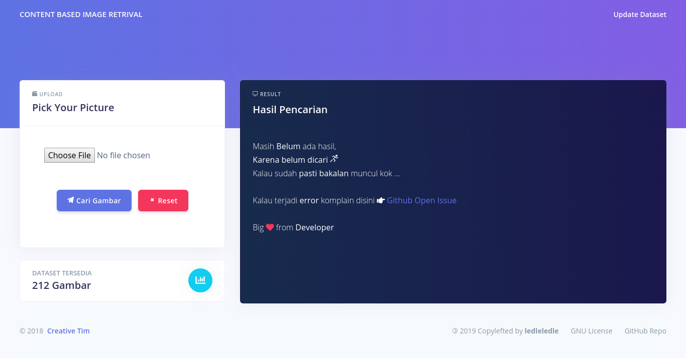
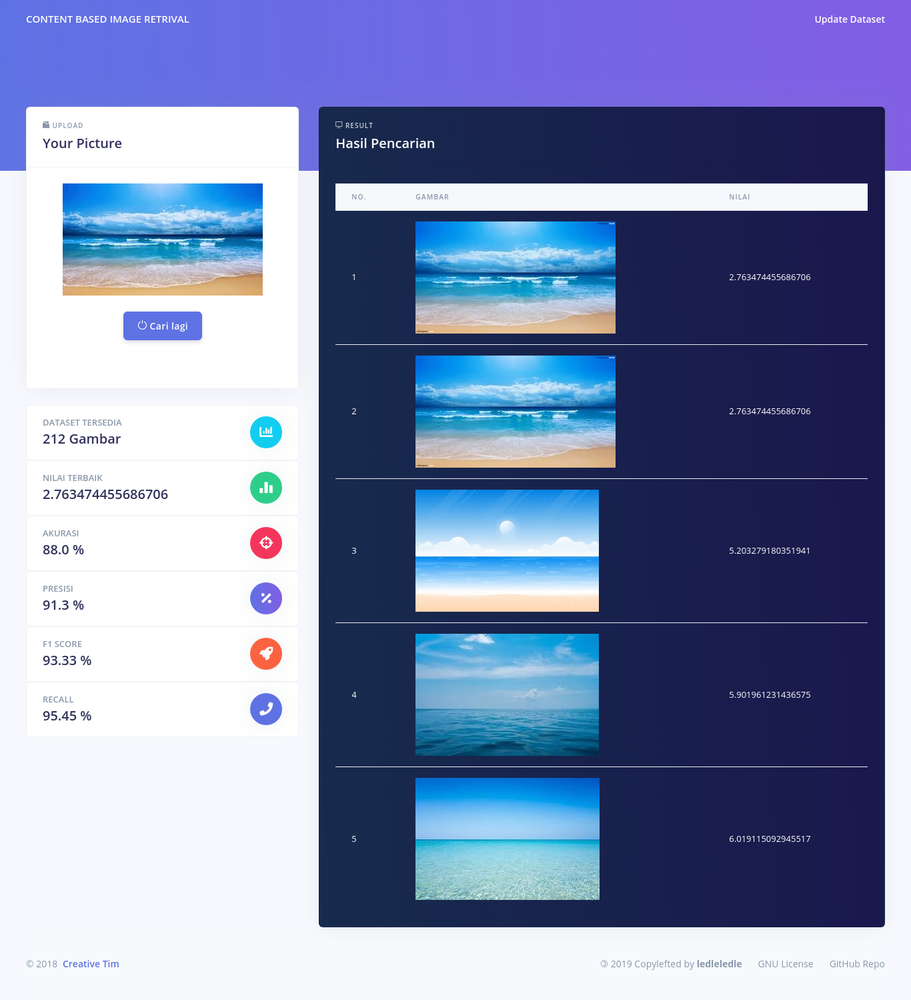

# WebCBIR

This repo reffer from this <a href="https://github.com/ledleledle/CBIR">Repository</a> and i just convert it to some web. I'm using <a href="https://demos.creative-tim.com/argon-dashboard-pro/">Argon Template</a> which its nice :) . Its just like google image search but i just showing 5 picture most relevant (hopefully most relevant with object). Like always... Its just a school project. The datasets focus on desert, sea and mountain, also i add some wrong random image for testing. Sadly the datasets still have duplicate :(

### Before you start
> - Don't ask me how to clone retard :)
> - This is development server if you want to host on production server, you find out your own way!
> - For Windows users, i highly recommended using [Python 3.7.0](https://www.python.org/ftp/python/3.7.0/python-3.7.0.exe) or [Python 3.6.0](https://www.python.org/ftp/python/3.6.0/python-3.6.0.exe)

# Dependencies that we need
- Python 3.x
- virtualenv

# Installation
### Arch Linux
```
sudo pacman -Syu python-pip python-virtualenv
```

### Ubuntu
```
sudo apt-get install python3-pip
pip3 install virtualenv
```

### Windows
Too much GUI Installer and a bit tricky compared by Linux, and I didn't like that alot.<br>
[Follow this tutorial to install Python, pip and virtualenv](https://phoenixnap.com/kb/how-to-install-python-3-windows). Then you'll be okay. Also, if you're facing problem like this.
```

```
Copy
```

```
Then paste on
```

```
<br>
**FYI** : For Windows users. No **GUI** please, only **CMD**.

# Usage
- Go to cloned folder `cd WebCBIR`
- Create virual environment `virtualenv venv`
- Activate **virtualenv**. Run <code>source venv/bin/activate</code> for **Linux Family** or if you're **Windows user** run `.\venv\Scripts\activate.bat`
- For requirements. Just run <code>pip install -r requirements.txt</code> and you'll be okay.
- Then just run the python file <code>python runner.py</code>
- Open <code>localhost:5000</code> on your browser
- Enjoy
- If you want to update the dataset, Just do it from terminal (after you copy or change the images) run <code>python index-console.py</code>

# Preview
- Before Searching

- After Searching


My method is, you upload the image, opencv and numpy process your image, system will save image to the temporary folder, showing the result, and the <code>app.route('/')</code> i use for checking the temporary folder is there exist or not. I will keep update this project and keep find the best method for best result. Hope you enjoy

Sorry for my bad English :(

# Note
Make PR's if you have any problem. Cheers 🍻

# TODO
- [X] Responsive Design
- [ ] Add & Update Dataset
- [ ] Increasing searching speed